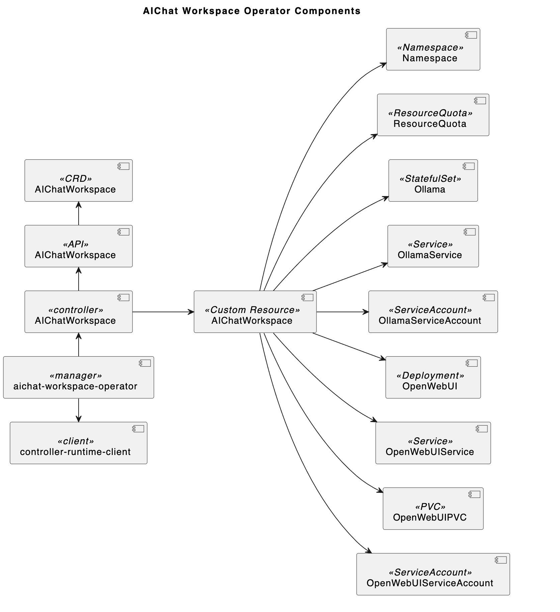
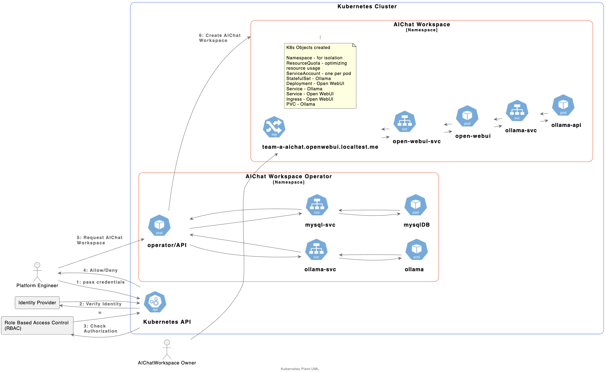

# AIChat Workspace Operator

Create AIChat Workspaces powered by [Open WebUI](https://openwebui.com/) and [Ollama](https://ollama.com/)

## Objectives

Create a Kubernetes Operator that creates the `control-plane` for a **Namespace-as-a-Service**. The operator should manage the lifecycle of each Kubernetes resource needed to run the selected service in a namespace. By dynamically creating, and managing the resources needed to run a AIChat Workspace. The resources for each AIChat Workspace should be separated and scaled-to-zeros when there has been no requests, reducing interference between tenants and optimizing resource utilization.

Create a **LLM-as-a-Service** using Ollama to provide the API for interacting with LLMs. The interface to this will be an AIChat Workspace or direct calls to the Ollama API endpoint.

Create a Web Frontend and API endpoint for interacting with the AIChat Workspace Controller. This part of the project will use the Gin Framework and MySQL, and implement JWT authentication to secure various API endpoint(s). The project will have a number of endpoints; user registration, login, profile, and management of AIChat Workspace.

Create a Model from a modelfile that sets the `SYSTEM` prompt for the model using one-to-many [fabric/patterns](https://github.com/danielmiessler/fabric/tree/main/patterns) `SYSTEM` prompts. The current supported patterns are:

- https://github.com/danielmiessler/fabric/blob/main/patterns/ai/system.md
- https://github.com/danielmiessler/fabric/blob/main/patterns/create_summary/system.md
- https://github.com/danielmiessler/fabric/blob/main/patterns/explain_code/system.md
- https://github.com/danielmiessler/fabric/blob/main/patterns/translate/system.md


## Design and Implementation

### Design


The purpose of this design is to support running AIChat Workspaces within a Namespace as a Service offering.




Personas that will interact with the environment. Platform Engineers, and AIChatWorkspace owners



## Implementation

- Used go version 1.23
- Used Kubebuilder to generate most of the code.
- Used Kind to create the K8s cluster running v1.31.0.
- KEDA's `HTTPScaledObject` is being used to address the **scale-to-zero** requirement.
- Defaulted to xSmall LLMs i.e. `gemma2:2b`, `llama3.2:1b`, and `qwen2.5-coder:1.5b` in custom resource manifests. 

Legend: ❌ roadmap ✅ completed initial implementation

- ✅ Controller for `AIChatWorkspace` resources
- ✅ The `AIChatWorkspace` represents the resources needed to run [Open WebUI](https://openwebui.com/) and [Ollama](https://ollama.com/) in a namespace.
- ✅ When a new `AIChatWorkspace` is created. Create each Kubernetes resource located [here]](https://github.com/open-webui/open-webui/tree/main/kubernetes/manifest/base) as the base.
- ✅ Handle updates to `AIChatWorkspace` and owned resources
- ✅ Handle deletions of `AIChatWorkspace` ensuring the associated resources are also deleted.
- ✅ Handle pulling in requested models
- ✅ Create model from modelfile using a SYSTEM prompts from [fabric/patterns](https://github.com/danielmiessler/fabric/tree/main/patterns)
- ✅ API endpoint for register and login and calling a protected endpoint. (use: curl, postman, etc)
- Manage the lifecycle of each application (Open WebUI and Ollama)
- ✅ e2e testing (using Kyverno Chainsaw)
- ❌ Scale-to-Zero after no request are received for a period of time. (scale up on new requests)
- ❌ Helm chart (with unittest)
- ❌ API endpoint to manage AIChat workspace. (use: curl, postman, etc)
- ❌ Web Frontend

### Components that will be dynamically created and managed:

* ✅ Namespace - for isolation
* ✅ ResourceQuota - optimizing resource usage
* ✅ ServiceAccount - one per service (to ensure the workloads are not using the default)
* ✅ Statefulset - running Ollama
* ✅ Deployment - running Open WebUI
* ✅ PVC to store the downloaded LLMs
* ✅ Kubernetes Service for Ollama
* ✅ Kubernetes Service for Open WebUI
* ❌ Ingress object for Ollama
* ❌ Ingress object for Open WebUI
* ❌ NetworkPolicy allow traffic to Ollama ingress from Open WebUI only
* ❌ NetworkPolicy allow traffic from ingress controller namespace to Open WebUI
* ❌ KEDA HTTPScaledObject to scale the Open WebUI to zero after no requests are received based on `scaledownPeriod`.
* ❌ KEDA Kubernetes Workload to scale based on the number of Open WebUI replicas
* ❌ K8s ExternalService for open-webui scale-to-zero functionality

### Dependencies

This project has a number of external dependencies that contribute to the **Namespace as a Service** solution

* ✅ Database for the AIChat Workspace API. User information
* ✅ Ingress controller
* ❌ CNI that supports network policies (optional)
* ❌ Statefulset running Ollama (will be used for SRE features)
* ❌ Vault to manage secrets for the API database
* ✅ KEDA for scale-to-zero of AIChat Workspaces

### Features before considered feature complete

* ❌ Support for each `system.md` located under [fabric/patterns](https://github.com/danielmiessler/fabric/tree/main/patterns)
* ❌ Built in SRE that monitors the events of AIChat Workspace workloads and interact with LLM to identify a solution.
* ❌ List of resource in the describe of the aichatworkspace object. (pods, pvc, svc, models running, etc)
* ❌ add open-webui's [pipelines](https://github.com/open-webui/pipelines) workload as an option.

# Getting Started

### Prerequisites
- go version v1.23.0+
- kubectl version v1.31.0+.
- A Kubernetes cluster. (Developed/Tested using Kind v1.31.0+)


### To Test this project

* To run unit tests.

```sh
make test
```

* To run chainsaw e2e tests.

```sh
make chainsaw
```

### Run the project

Running the script below will create install everything needed to run this locally using a kind create cluster.

```sh
./from-scratch.sh
```